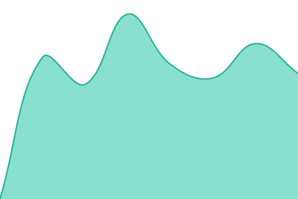
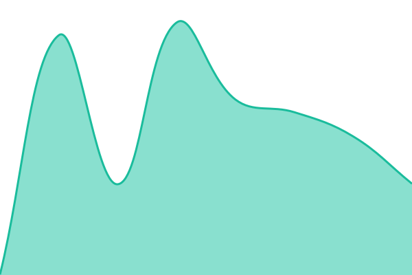

# [📈 Live Status](https://staus.nb.gl): <!--live status--> **🟩 All systems operational**

This repository contains the open-source uptime monitor and status page for [SuperPaxxs](https://staus.nb.gl), powered by [Upptime](https://github.com/upptime/upptime).

With [Upptime](https://upptime.js.org), you can get your own unlimited and free uptime monitor and status page, powered entirely by a GitHub repository. We use [Issues](https://github.com/Paxxs/uptime/issues) as incident reports, [Actions](https://github.com/Paxxs/uptime/actions) as uptime monitors, and [Pages](https://staus.nb.gl) for the status page.

<!--start: status pages-->
<!-- This summary is generated by Upptime (https://github.com/upptime/upptime) -->
<!-- Do not edit this manually, your changes will be overwritten -->
<!-- prettier-ignore -->
| URL | Status | History | Response Time | Uptime |
| --- | ------ | ------- | ------------- | ------ |
|  [Blog (gz99)](https://www.morfans.cn) | 🟩 Up | [blog-gz99.yml](https://github.com/Paxxs/uptime/commits/HEAD/history/blog-gz99.yml) | 

 3331ms
     
 | 

<a href="https://status.nb.gl/history/blog-gz99">100.00%</a>
    

|  BitKey (gz99) | 🟩 Up | [bit-key-gz99.yml](https://github.com/Paxxs/uptime/commits/HEAD/history/bit-key-gz99.yml) | 

 1040ms
     
 | 

<a href="https://status.nb.gl/history/bit-key-gz99">100.00%</a>
    

|  TXCloud (gz99) | 🟩 Up | [tx-cloud-gz99.yml](https://github.com/Paxxs/uptime/commits/HEAD/history/tx-cloud-gz99.yml) | 

 1079ms
     
 | 

<a href="https://status.nb.gl/history/tx-cloud-gz99">100.00%</a>
    

|  [Lab (AWS)](https://lab.morfans.cn) | 🟩 Up | [lab-aws.yml](https://github.com/Paxxs/uptime/commits/HEAD/history/lab-aws.yml) | 

 375ms
     
 | 

<a href="https://status.nb.gl/history/lab-aws">100.00%</a>
    

|  Server Monitor (bwg) | 🟩 Up | [server-monitor-bwg.yml](https://github.com/Paxxs/uptime/commits/HEAD/history/server-monitor-bwg.yml) | 

 556ms
     
 | 

<a href="https://status.nb.gl/history/server-monitor-bwg">100.00%</a>
    

<!--end: status pages-->

[**Visit our status website →**](https://staus.nb.gl)

## 📄 License

- Powered by: [Upptime](https://github.com/upptime/upptime)
- Code: [MIT](./LICENSE) © [Anand Chowdhary](https://anandchowdhary.com), supported by [Pabio](https://pabio.com)
- Data in the `./history` directory: [Open Database License](https://opendatacommons.org/licenses/odbl/1-0/)
